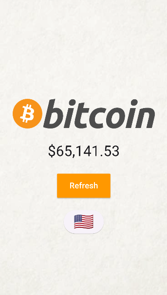
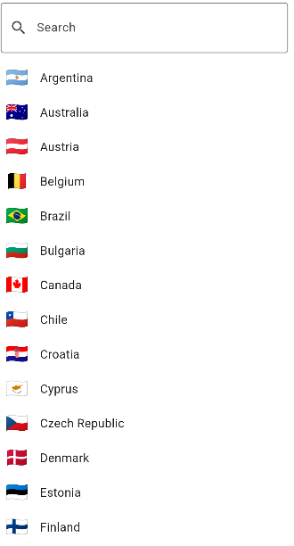

  

# PriceCoin
“*Receive the Bitcoin price in real time.*”

## Glossary

- [About the PriceCoin](#about-the-pricecoin)
- [User Guide](#user-guide)
- [Technical Requirements](#tecnical-requirements)
    - [Versions](versions)

## About the PriceCoin
PriceCoin is a small learning project, overly simple with the sole purpose of practicing the Dart programming language along with the Flutter framework. Specifically, I created this project to practice asynchronous programming in Dart using widgets like FutureBuilder. Additionally, there's also configured internationalization using the **country_picker** widget.

## User Guide

The app is extremely simple. Upon opening, the Bitcoin price corresponding to your device's location will already be displayed.

Additionally, if the user wishes to check the Bitcoin price in another currency, they simply need to select the flag emoji icon just below and choose the desired country.

If the user's device location is not included in the predefined list of configured countries, then the app will set USA with the American dollar as the default location.

## Technical Requirements

The PriceCoin app works on both Android and iOS.

**For iOS, this app was not tested!** I don't have the means, and no, I won't use Hackintosh or rent some mac :)

### Versions

| Technology | Version |
|---|---|
| Android  | 14  |
| Android API Level  | 34  |
| Flutter  | 3.19.2  |
| Dart  | 3.3.0  |